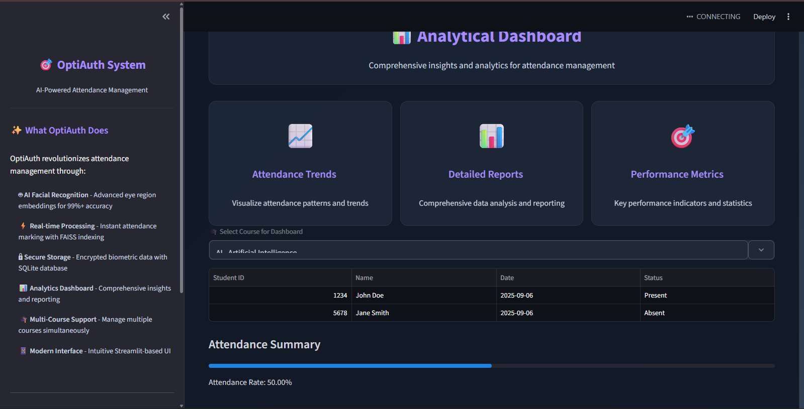
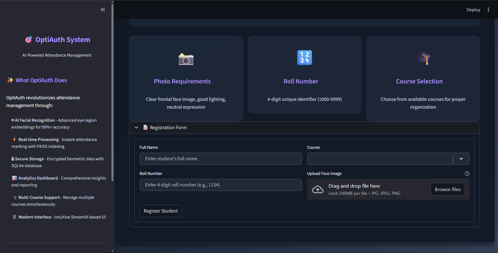
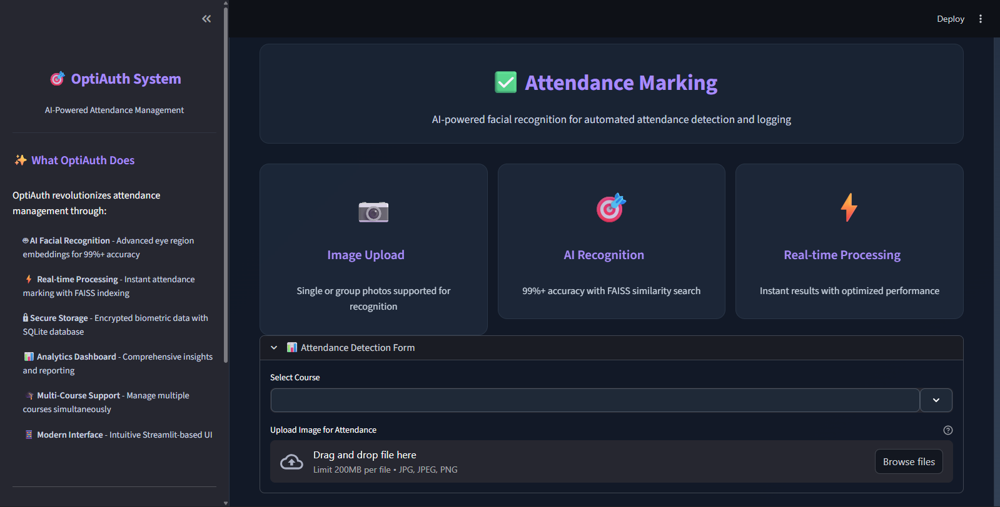

# 🎯 OptiAuth - AI-Powered Attendance Management System

<div align="center">


[](https://python.org)
[](https://streamlit.io)
[](https://opencv.org)
[](https://faiss.ai)

**Revolutionizing Education with Cutting-Edge Facial Recognition Technology**

[🚀 Quick Start](#-quick-start) • [✨ Features](#-features) • [📖 Documentation](#-documentation) • [🤝 Contributing](#-contributing)

</div>

---

## 🌟 Overview

**OptiAuth** is a next-generation AI-driven attendance management system that transforms how educational institutions handle student registration and attendance tracking. Built with state-of-the-art facial recognition technology, it delivers unparalleled accuracy, security, and efficiency for modern educational environments.

### 🎯 What OptiAuth Does

OptiAuth revolutionizes attendance management through:

- **🤖 AI-Powered Recognition** - Advanced facial recognition using eye region embeddings for 99%+ accuracy
- **⚡ Real-time Processing** - Instant attendance marking with FAISS indexing for lightning-fast searches  
- **🔒 Secure Storage** - Encrypted biometric data with enterprise-grade SQLite database
- **📊 Analytics Dashboard** - Comprehensive insights and reporting for data-driven decisions
- **🎓 Multi-Course Support** - Manage multiple courses simultaneously with isolated data structures
- **📱 Modern Interface** - Intuitive Streamlit-based UI with dark theme and responsive design

---

## ✨ Key Features

### 🎯 Core Capabilities

| Feature | Description | Technology |
|---------|-------------|------------|
| **👥 Student Registration** | Seamlessly enroll students with facial biometrics, roll numbers, and course details | DeepFace + MediaPipe |
| **📊 Attendance Marking** | Upload single or group photos for automated recognition and logging | FAISS + ArcFace |
| **📈 Analytics Dashboard** | Visualize attendance records, trends, and comprehensive reports | Streamlit + SQLite |
| **🔍 Advanced Search** | FAISS-powered similarity search with configurable thresholds | Vector Database |
| **🎓 Multi-Course Management** | Isolated FAISS indices and organized data structures | Course-specific Architecture |
| **🔒 Data Security** | Encrypted biometric storage and secure data handling | SQLite + BLOB Storage |

### 🛠️ Technical Highlights

- **🎯 99%+ Recognition Accuracy** - Advanced eye region embeddings minimize false positives
- **⚡ Real-time Processing** - Optimized FAISS indexing for instant similarity searches
- **🔧 Scalable Architecture** - Course-specific data isolation and efficient resource management
- **📱 Responsive Design** - Modern UI with dark theme, animations, and mobile compatibility
- **🛡️ Enterprise Security** - Encrypted data storage and secure biometric handling

---

## 🚀 Quick Start

### 📋 Prerequisites

- **Python 3.12+** 🐍
- **Git** 📦
- **Virtual Environment** (recommended) 🔧

### 🛠️ Installation

1. **Clone the Repository**
   ```bash
   git clone https://github.com/BrightsSolution/OptiAuth.git
   cd OptiAuth
   ```

2. **Set Up Virtual Environment**
   ```bash
   # Create virtual environment
   python3.12 -m venv venv
   
   # Activate environment
   # Windows:
   venv\Scripts\activate
   # Linux/Mac:
   source venv/bin/activate
   ```

3. **Install Dependencies**
   ```bash
   pip install -r requirements.txt
   ```

4. **Install System Dependencies** (Linux/Ubuntu)
   ```bash
   sudo apt update
   sudo apt install -y libpng-dev libjpeg-dev libz-dev
   pip install opencv-python-headless
   ```

5. **Run the Application**
   ```bash
   streamlit run app.py
   ```
   Access at: `http://localhost:8501` 🌐

---

## 📖 Documentation

### 🏗️ Architecture Overview

```
OptiAuth/
├── 🎯 main.py              # Landing page with project overview
├── 🚀 app.py               # Main application interface
├── 📁 src/                 # Core source code
│   ├── 🤖 extract_embeddings.py  # AI facial recognition
│   ├── 🗄️ database.py           # Database operations
│   ├── 🔍 faiss_index.py        # Vector search engine
│   ├── 👥 register_students.py  # Student enrollment
│   ├── ✅ mark_attendance.py    # Attendance marking
│   └── ⚙️ config.py             # Configuration management
├── 📁 database/            # SQLite database files
├── 📁 images/              # Student photos and test images
├── 🎨 static/styles.css    # Modern UI styling
└── 📋 requirements.txt     # Python dependencies
```

### 🔧 Technology Stack

#### **Core Technologies**
- **🐍 Python 3.12+** - Primary programming language
- **🤖 DeepFace (ArcFace)** - Facial recognition and embeddings
- **👁️ MediaPipe** - Eye region detection and preprocessing
- **🔍 FAISS** - Vector similarity search and indexing
- **🗄️ SQLite** - Lightweight database for data persistence

#### **Web Framework**
- **🌐 Streamlit** - Rapid web application development
- **🎨 Custom CSS/HTML** - Modern UI with dark theme
- **📱 Responsive Design** - Mobile and desktop compatibility
- **⚡ Real-time Updates** - Live data processing and display

### 📊 Usage Guide

#### **1. Student Registration** 👥
- Navigate to the "Student Registration" tab
- Enter student details (name, 4-digit roll number, course)
- Upload a clear frontal face image
- Submit to register and update the FAISS index

#### **2. Attendance Marking** ✅
- Go to the "Attendance Marking" tab
- Select the appropriate course
- Upload single or group photos for recognition
- System processes embeddings and logs attendance automatically

#### **3. Analytics Dashboard** 📊
- Access the "Analytics Dashboard" tab
- Select a course to view attendance records
- Analyze data frames, summaries, and attendance rates
- Export reports for further analysis

---

## 🔧 Configuration

### ⚙️ System Settings

Key configuration parameters in `src/config.py`:

```python
# Database Configuration
DATABASE_PATH = "database/attendance.db"

# Image Directories
INPUT_IMAGES_DIR = "images/input_imgs"
TEST_IMAGES_DIR = "images/test_imgs"

# Course Configuration
COURSES = {
    "AI": "Artificial Intelligence",
    "GD": "Graphic Design"
}

# Recognition Thresholds
FAISS_THRESHOLD = 0.4  # Similarity threshold for matches
EMBEDDING_DIM = 512    # DeepFace embedding dimensions
```

### 🎯 Performance Optimization

- **FAISS Indexing**: Optimized for course-specific searches
- **Image Preprocessing**: Grayscale equalization for better recognition
- **Memory Management**: Efficient embedding storage and retrieval
- **Caching**: Session-based caching for improved performance

---

## 📸 Screenshots

<div align="center">

### 🏠 Landing Page

*Modern landing page with project overview and features*

### 👥 Student Registration

*Intuitive student enrollment interface with biometric capture*

### ✅ Attendance Marking

*AI-powered attendance detection and logging*

### 📊 Analytics Dashboard

*Comprehensive analytics and reporting interface*

</div>

---

## 🤝 Contributing

We welcome contributions to OptiAuth! Here's how you can help:

### 🚀 Getting Started

1. **Fork the Repository** 🍴
   ```bash
   git fork https://github.com/Brights-Solution/OptiScan
   cd OptiScan
   ```

2. **Create Feature Branch** 🌿
   ```bash
   git checkout -b feature/AmazingFeature
   ```

3. **Make Changes** ✏️
   - Follow our coding standards
   - Add tests for new features
   - Update documentation

4. **Commit Changes** 💾
   ```bash
   git commit -m "Add some AmazingFeature"
   ```

5. **Push to Branch** 📤
   ```bash
   git push origin feature/AmazingFeature
   ```

6. **Open Pull Request** 🔄
   - Describe your changes
   - Link any related issues
   - Request review from maintainers

### 🎯 Areas for Contribution

- **🎨 UI/UX Improvements** - Enhanced user interface and experience
- **🤖 AI Accuracy** - Better recognition algorithms and preprocessing
- **📊 Analytics** - Advanced reporting and visualization features
- **🔒 Security** - Enhanced data protection and privacy measures
- **📱 Mobile Support** - Improved mobile responsiveness
- **🌐 Deployment** - Cloud deployment and scaling solutions

---

## 📄 License

This project is licensed under the **MIT License** - see the [LICENSE](LICENSE) file for details.

```
MIT License

Copyright (c) 2024 BrightSolution

Permission is hereby granted, free of charge, to any person obtaining a copy
of this software and associated documentation files (the "Software"), to deal
in the Software without restriction, including without limitation the rights
to use, copy, modify, merge, publish, distribute, sublicense, and/or sell
copies of the Software, and to permit persons to whom the Software is
furnished to do so, subject to the following conditions:

The above copyright notice and this permission notice shall be included in all
copies or substantial portions of the Software.
```

---

## 👨‍💻 Developed By

<div align="center">

### **BrightSolution** 🌟

**Innovative Software Solutions for AI-Driven Applications**

[](https://github.com/BrightsSolution)
[](mailto:info@brightsolution.com)

*Transforming education through cutting-edge technology*

</div>

---

## 🙏 Acknowledgments

- **DeepFace Team** - For the amazing facial recognition library
- **Facebook AI Research** - For the FAISS vector search engine
- **Streamlit Team** - For the excellent web framework
- **OpenCV Community** - For computer vision tools and utilities
- **Educational Institutions** - For feedback and testing support

---

## 📞 Support & Contact

- **📧 General Inquiries**: [info@brightsolution.com](mailto:info@brightsolution.com)
- **🔴 Live Demo**: [OptiScan](https://aioptiscan.streamlit.app/)
---

<div align="center">

**⭐ Star this repository if you find it helpful!**

*Made with ❤️ by BrightSolution*

[](https://github.com/BrightsSolution/OptiAuth/stargazers)
[](https://github.com/BrightsSolution/OptiAuth/network)

</div>
